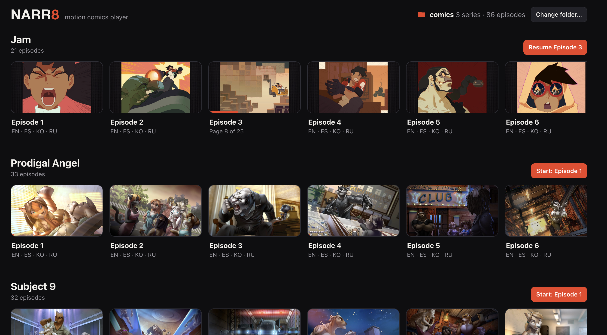
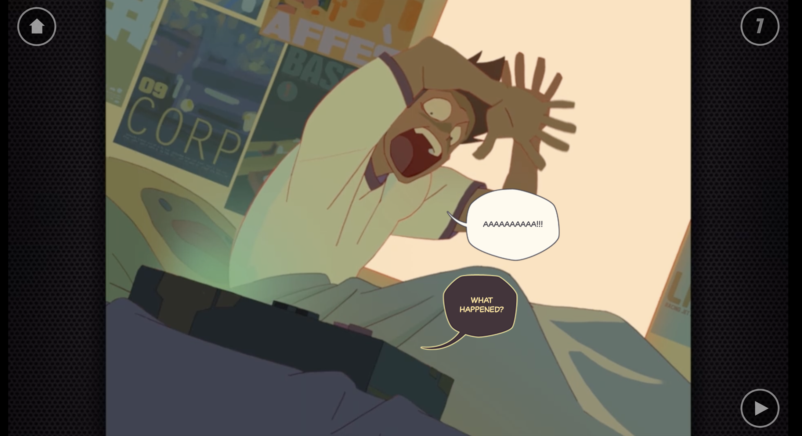
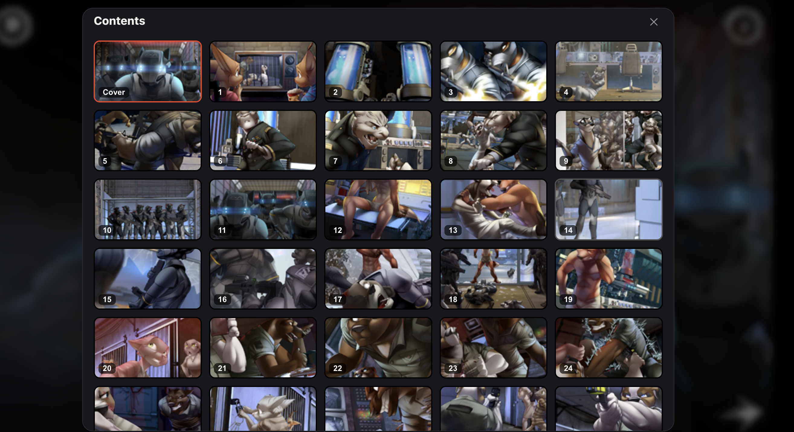

# narr8-reader
Web app that can launch NARR8 comics

App is fully vibe coded. I don't claim of the reverse-engineered code, you are free to use it however you want.

Just drop your comics inside the comic folder. You can download some of the comics from [here](https://archive.org/details/narr8-2-3-51)

## Screenshots

**Library:** every series in your comics folder, with covers and reading progress.



**Player:** the episode's original animations, balloons, music, and tap-to-continue pacing.



**Contents:** jump to any page of the episode.



## How to launch

You need a web browser and any static web server. Python 3 is already installed on macOS and most Linux systems. Chrome or Edge is recommended, because they remember your comics folder between visits.

1. **Get the code.**
   ```bash
   git clone https://github.com/AlexShashkov/narr8-reader.git
   cd narr8-reader
   ```

2. **Put your comics into the `comics` folder.** Each series gets its own folder; the player finds episode zips and covers at any depth:
   ```
   comics/
   ├─ Prodigal Angel/
   │  ├─ Episodes/        Prodigal Angel.Ep_01.50587a955050e8a92d00055b.zip …
   │  └─ Episode covers/  Prodigal Angel.ep01.jpg …
   ├─ Jam/
   │  ├─ Episodes/        Jam.Ep_01.513f8806a5159rdVZ4y_540.zip …
   │  └─ Episode covers/  Jam.ep01.jpg …
   └─ Subject 9/
      ├─ Episodes/        Subject 9.Ep_01.5051d5055050e8357e00063d.zip …
      └─ Episode covers/  Subject 9.ep01.cover.jpg …
   ```
   Leave the zips as they are; don't unpack them.

3. **Start a local web server** in the `narr8-reader` folder:
   ```bash
   python3 -m http.server 8080
   ```
   Any static server works, for example `npx serve -l 8080`. Opening `index.html` directly as a file does **not** work: the player needs `http://localhost` or `https://` for its Service Worker.

4. **Open <http://localhost:8080>**, click **Select comics folder…**, and choose the `comics` folder.

   Nothing is uploaded or copied. The player reads each episode straight from its zip on your disk while you watch.

The next time you open the page, Chrome and Edge ask for one click to reconnect to the folder. Safari and Firefox ask you to select it again. On devices that can't pick folders (iPhone/iPad), use **Select episode files instead** and pick the zips and covers.

To stop the server, press `Ctrl+C` in the terminal.

### Hosting it online

The app is plain static files, with no build step and no backend. It can be published as is on GitHub Pages, Netlify, or any web host. Visitors still pick comics from their own disk.

## Controls

| Action | Mouse / keyboard | Touch |
|---|---|---|
| Next | click the ➜ arrow (bottom-right), `→`, `Space`, `Enter` | tap the arrow, or swipe left (newer episodes) |
| Previous scene | `←` | swipe right (newer episodes) |
| Contents | the page-number badge (top-right), `C` | tap the badge |
| Menu (language, start over, fullscreen, library) | the house icon (top-left), `Esc` | tap the house |
| Fullscreen | `F` | — |

Progress is saved per episode, so **Resume** continues where you stopped. The language (EN / ES / KO / RU, when the episode has them) can be switched mid-episode.

## How it works

Every NARR8 episode zip is a self-contained HTML5 app: `canvas.html`, the engine scripts (`utils/`), plugins, videos, music, balloon art, and one `data.js` per language describing every scene. The iOS/Android apps were thin shells around it. They played the video natively under a transparent WebView and talked to the engine through a `native://` bridge.

The engine also had a browser mode for the old narr8.com web player. That player's own files (`foreditor/*.js`) were never shipped inside episodes and are lost, which is why the zips could no longer run. This project rebuilds them in `shim/`:

| File | Replaces | What it does |
|---|---|---|
| `shim/navigation.js` | `foreditor/navigation.js` | The host API the engine talks to: start-up handshake, page tracking, contents and menu buttons, end of episode |
| `shim/foreditor.js` | `foreditor/foreditor.js` | Boots the HTML5 path on every device, adds touch input and keyboard controls, handles autoplay blocking, resizing, and pausing |
| `shim/video.js` | `foreditor/video.js` | HTML5 video player for the 2012–2013 engine: timed pauses, seamless loops, timing events, scene transitions |
| `shim/mouse.js` | `foreditor/mouse.js` | Mouse input for the 2012–2013 engine |

The episodes use two engine generations, and both are supported. Of the 86 episodes of *Jam*, *Prodigal Angel* and *Subject 9*, 50 use the 2013–2015 "universal" engine and 36 use the 2012–2013 "video" engine.

The rest of the app:

- `index.html`, `app.js`, `style.css`: the library, folder scanning, and the player UI around the episode frame.
- `sw.js`: a Service Worker that makes a zip on your disk look like a web folder to the episode's engine. It supports HTTP Range requests for video seeking.
- `zip.js`: a small dependency-free zip reader built on the browser's `DecompressionStream`.
- `db.js`: remembers the chosen folder and caches scan results in IndexedDB.

No episode file is modified; the original engine runs untouched in an iframe.
